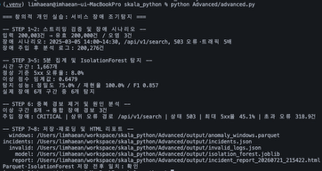
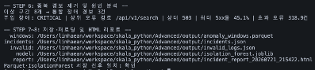
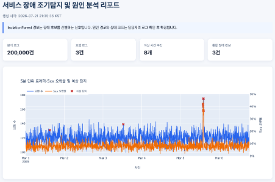
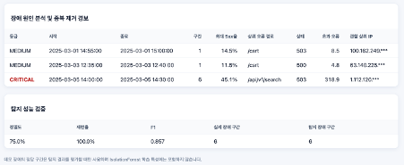
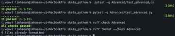

# Advanced 실습 보고서

## 웹 로그 기반 서비스 장애 조기탐지 및 원인 분석 시스템

- 프로그램명: 서비스 장애 조기탐지 및 원인 분석 시스템
- 작성자: 광주_3반_임해안
- 작성일: 2026-07-21
- 활용 데이터: `data/web_logs.csv` 200,000건

---

## 1. 실습 배경 및 문제 정의

운영 환경에서 발생하는 수십만 건의 웹 로그를 사람이 직접 확인하여 장애를 찾는 것은 어렵다. 단순히 `5xx 오류율 10% 초과`와 같은 고정 임계값만 사용하면 정상적인 트래픽 변화에도 불필요한 경보가 발생할 수 있으며, 장애가 지속되는 동안 같은 경보가 반복되어 대응 효율이 낮아질 수 있다.

따라서 이번 개인 실습에서는 다음 질문을 해결하고자 했다.

> 평소와 다른 트래픽 및 오류 패턴을 자동으로 탐지하고, 장애에 가장 크게 기여한 경로와 상태 코드를 찾아 운영자가 바로 대응할 수 있도록 할 수 있는가?

이를 위해 대용량 로그 검증, 시간 단위 집계, 비지도 머신러닝, 장애 원인 분석과 자동 HTML 리포트를 하나의 파이프라인으로 구현했다.

---

## 2. 기존 실습 활용 및 확장 내용

### 2.1 기존 실습에서 활용한 내용

| 기존 학습 내용 | 이번 실습 적용 내용 |
|---|---|
| Day1 대용량 로그 처리 | 20만 건 CSV를 5만 건씩 청크 처리 |
| Day1 Pydantic 검증 | IP, 시각, 메서드, 경로, 상태 코드, 전송량 검증 |
| Day1 유효·오염 데이터 분리 | 검증 실패 로그와 필드별 오류를 별도 JSON으로 격리 |
| Day2 Pandas·Polars | 장애 시나리오 생성 및 5분 단위 로그 집계 |
| Day2 머신러닝 Pipeline 경험 | IsolationForest 기반 비지도 이상 탐지 모델 구현 |
| Day2 모델 저장 | Joblib 저장 후 재로딩 결과 일치 검증 |
| Day2 Parquet | 시간 구간별 탐지 결과 저장 및 라운드트립 검증 |
| Day2 Plotly·Jinja2 | 장애 시계열과 원인 분석 HTML 리포트 생성 |

### 2.2 새롭게 확장한 내용

기존 실습 1에서는 경로별·상태별·시간대별 요청 수를 집계하는 데 집중했다. 이번 실습에서는 집계 결과를 머신러닝 특성으로 활용해 다음 기능을 추가했다.

1. **비지도 이상 탐지**
   - 장애 정답이 없는 상황에서도 정상 패턴과 다른 구간을 찾도록 IsolationForest를 적용했다.

2. **시간 순서를 고려한 정상 기준 학습**
   - 장애 시점 이전 데이터만 모델 학습에 사용해 미래 장애 정보가 학습에 포함되는 데이터 누수를 방지했다.

3. **재현 가능한 장애 시뮬레이션**
   - 특정 검색 API에 503 오류와 트래픽 급증을 주입해 탐지 성공 여부를 객관적으로 평가했다.

4. **경보 중복 제거**
   - 연속된 5분 이상 구간을 각각 알리지 않고 하나의 장애 사건으로 통합했다.

5. **장애 원인과 영향 분석**
   - 상위 오류 경로, 상태 코드, 최대 오류율과 정상 수준 대비 초과 오류 수를 계산했다.

6. **운영 리포트 자동화**
   - KPI, 시계열 차트, 장애 목록과 탐지 성능이 포함된 HTML 리포트를 자동 생성했다.

---

## 3. 전체 처리 과정

```text
웹 로그 CSV
   ↓ 청크 단위 읽기
Pydantic 스키마 검증
   ↓
유효 로그 / 오염 로그 분리
   ↓
503 오류·트래픽 급증 장애 시뮬레이션
   ↓
Polars 5분 단위 특성 집계
   ↓
IsolationForest 정상 기준 학습 및 이상 탐지
   ↓
정밀도·재현율·F1 평가
   ↓
연속 경보 통합 및 장애 원인 분석
   ↓
Parquet·JSON·Joblib·HTML 산출물 저장
```

5분 단위로 사용한 주요 특성은 다음과 같다.

- 전체 요청 수
- 5xx 오류 수
- 5xx 오류율
- 고유 접속 IP 수
- 평균 전송량
- 전송량 95백분위수
- 요청 경로 종류 수

---

## 4. 장애 시나리오 설계

원본 로그 파일은 수정하지 않고 메모리에서 다음 장애를 재현했다.

| 항목 | 설정값 |
|---|---|
| 장애 시간 | 2025-03-05 14:00~14:30 |
| 장애 경로 | `/api/v1/search` |
| 장애 상태 코드 | `503 Service Unavailable` |
| 트래픽 변화 | 기존 대비 5배 |
| 평가 단위 | 5분 |
| 실제 장애 구간 | 6개 |

추가로 Pydantic 검증을 확인하기 위해 잘못된 IP, 범위를 벗어난 상태 코드 `999`, 음수 전송량을 각각 1건씩 추가했다. 이 데이터는 검증 단계에서 모두 오염 로그로 분리되어야 한다.

---

## 5. 실행 결과

### 5.1 로그 검증과 장애 주입

- 전체 입력: 200,003건
- 유효 로그: 200,000건
- 오염 로그: 3건
- 장애 주입 후 분석 로그: 200,276건
- 건수 검증: `200,003 = 200,000 + 3`



**해석:** 의도적으로 추가한 IP, 상태 코드, 전송량 오류 3건을 모두 찾아냈다. 원본 파일은 변경하지 않고 유효 로그의 복사본에만 장애를 주입했다.

### 5.2 IsolationForest 탐지 성능

- 분석 시간 구간: 1,667개
- 정상 기준 5xx 오류율: 8.0%
- 이상 점수 임계값: 0.6479
- 정밀도: 75.0%
- 재현율: 100.0%
- F1: 0.857
- 실제 장애 6개 구간 중 6개 탐지

**해석:** 실제 장애 구간을 하나도 놓치지 않아 재현율 100%를 달성했다. 총 8개의 이상 구간 중 6개가 주입 장애였기 때문에 정밀도는 75%였다. 나머지 2개 구간은 장애로 주입하지 않았지만 정상 기준과 다른 패턴을 보인 자연 이상 후보이며 추가 확인 대상이다.

### 5.3 경보 중복 제거 및 원인 분석

- 이상 시간 구간: 8개
- 통합 장애 경보: 3건
- 주입 장애의 연속 6개 구간: 하나의 경보로 통합
- 장애 심각도: CRITICAL
- 상위 오류 경로: `/api/v1/search`
- 주요 상태 코드: `503`
- 최대 5xx 오류율: 45.1%
- 정상 수준 대비 초과 오류: 약 318.9건



**해석:** 모델이 이상 여부만 알려주는 데서 끝나지 않고, 운영자가 확인해야 할 검색 API와 503 상태 코드를 원인 후보로 제시했다. 또한 연속 장애 경보를 하나로 합쳐 반복 알림 문제를 줄였다.

### 5.4 HTML 장애 분석 리포트





HTML 리포트에는 다음 내용이 포함된다.

- 분석 로그·오염 로그·이상 구간·통합 경보 KPI
- 요청량과 5xx 오류율 시계열
- IsolationForest 이상 탐지 지점
- 장애별 심각도, 시간, 상위 경로와 상태 코드
- 정밀도·재현율·F1 검증 결과
- 접속 IP 마지막 옥텟 마스킹

### 5.5 테스트와 코드 품질



```text
11 passed
All checks passed!
4 files already formatted
```

단위 테스트를 통해 다음 항목을 검증했다.

- 유효·오염 로그 분리
- 원본 불변성과 지정 구간 장애 주입
- 5분 집계와 오류율 계산
- 장애 이전 데이터만 사용하는 모델 학습
- 정밀도·재현율 계산
- 장애 심각도 경계
- 연속 경보 중복 제거
- 상위 오류 경로와 상태 코드 분석
- Parquet·모델 라운드트립
- HTML 차트와 IP 마스킹

---

## 6. 생성 산출물

| 산출물 | 설명 |
|---|---|
| `anomaly_windows.parquet` | 5분 단위 특성, 이상 점수와 탐지 결과 |
| `incidents.json` | 중복 제거된 장애와 원인·영향 분석 |
| `invalid_logs.json` | 오염 로그 원본과 필드별 오류 사유 |
| `isolation_forest.joblib` | IsolationForest 모델, 특성 목록과 탐지 임계값 |
| `incident_report_*.html` | 장애 시계열과 원인 분석 리포트 |

Parquet과 IsolationForest 모델은 저장 후 다시 불러와 저장 전 결과와 같은지 확인했다.

---

## 7. 성공 판정 기준 검토

| 성공 판정 기준 | 결과 | 판정 |
|---|---:|---|
| 입력 = 유효 + 오염 건수 | 200,003 = 200,000 + 3 | 통과 |
| 오염 예시 3건 탐지 | 3건 탐지 | 통과 |
| 장애 이전 정상 구간만 모델 학습 | 시간 조건으로 분리 | 통과 |
| 장애 구간 재현율 90% 이상 | 100.0% | 통과 |
| 탐지 정밀도 60% 이상 | 75.0% | 통과 |
| 상위 오류 경로 식별 | `/api/v1/search` | 통과 |
| 주요 상태 코드 식별 | `503` | 통과 |
| 연속 장애 경보 통합 | 6개 구간 → 1개 경보 | 통과 |
| Parquet·모델 재로딩 일치 | 일치 확인 | 통과 |
| 테스트·정적 검사 | 11 passed, Ruff 통과 | 통과 |

---

## 8. 한계점 및 향후 개선 방향

이번 실습의 장애는 탐지 성능을 객관적으로 확인하기 위해 인위적으로 주입한 시나리오다. 실제 운영에서는 배포, 이벤트, 요일과 시간대에 따른 정상적인 트래픽 변화도 이상으로 탐지될 수 있다.

향후에는 다음과 같이 개선할 수 있다.

- 시간대·요일별 정상 기준을 별도로 학습
- 응답시간과 CPU·메모리 같은 시스템 지표 결합
- 배포 이력과 장애 시점 연계
- Slack 또는 이메일 실시간 경보 전송
- 운영자 확인 결과를 이용한 임계값 재조정
- 모델과 데이터 분포 변화 모니터링

---

## 9. 결론

이번 실습에서는 기존의 단순 웹 로그 집계를 확장하여, 정상 패턴을 학습하고 장애 후보를 자동 탐지하는 비지도 머신러닝 시스템을 구현했다. 주입한 장애 6개 구간을 모두 찾아 재현율 100%를 달성했으며, 장애 경로 `/api/v1/search`와 상태 코드 `503`을 원인 후보로 정확하게 분석했다.

또한 연속 경보 중복 제거, 초과 오류 영향 계산, 모델·데이터 라운드트립, HTML 운영 리포트까지 구현하여 분석 결과가 실제 장애 대응 과정에서 활용될 수 있도록 확장했다.
